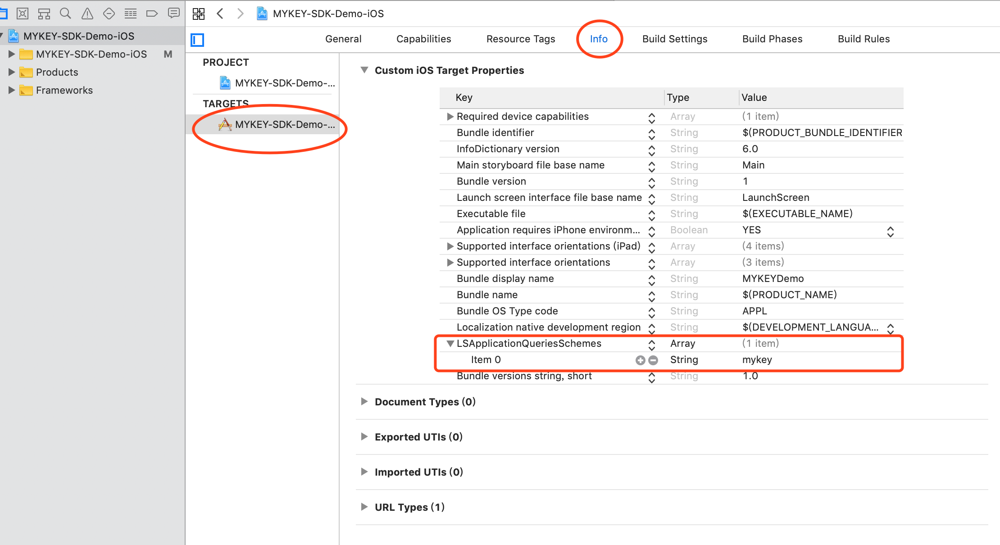
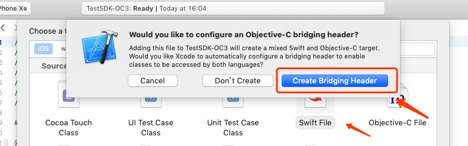

# MYKEY iOS SDK

## 1. How to integration

### 1.1 Download MYKEYWalletLib-iOS.zip from following link, unzip and place it into your project

https://github.com/mykeylab/MYKEY-Client-SDK/tree/master/iOS

### 1.2 Setup URL scheme in Xcode: Goto "Project->TARGETS->info->URL Types", click "add icon".

For example, use 'demoscheme' as follows


This configuration will generate a deeplink for MYKEY callback, which will be used in MYKEK SDK initlization. [See initWallet](#initwallet) and [See initWalletSimple](#initwalletsimple).

### 1.3 Add one more option on "LSApplicationQueriesSchemes" in info.plist, the value is "mykey"



### 1.4 Set "Enable Bitcode" to "false" in Build settings


### 1.5 Note

This library is using swift code, if your application is Objective-C project will need some special configuration

Project are required to create one empty swift file in project. For example, Empty.swift, meanwhile project will auto generate corresponding \<ProjectName-Bridging-Header.h\> file.


## 2. Initialize

### 2.1 Add "MYKEYWalletLib.h" file in "AppDelegate.m"

#### In swift
```
import MYKEYWalletLib
```

#### In Objective-C
```
#import <MYKEYWalletLib/MYKEYWalletLib.h>
```
### 2.2 Init

```
let initData = InitRequest()
initData.appKey = "xxxx"
initData.dappName = "DappNameA"
initData.dappIcon = "https:.../xx.png"
initData.UUID = UUID
initData.scheme = "demoscheme"
initData.disableInstall = true
MYKEYWallet.shared.initWallet(initData: initData)
```
For the param scheme, [refer scheme configuration in 1.2](#12-setup-url-scheme-in-xcode-goto-project-targets-info-url-types-click-add-icon)

### 2.3 Invoke handlerUrl in "application:openURL:"

```
MYKEYWallet.shared.handleUrl(url: url)
```
## Class MYKEYWallet


MYKEY iOS SDK's main logic is encapsulated in the MYKEYWallet class, which implements six methods, namely initWallet, initWalletSimple, authorize, transfer, contract, sign.


### Method Summary


| Methods          |         
|:-----------------:|
| [initWallet](#initwallet)      |
| [initWalletSimple](#initwalletsimple) |
| [authorize](#authorize) |
| [transfer](#transfer)  |
| [contract](#contract)  |
| [sign](#sign) |

### initWallet

Instantiate the class MYKEYWallet, initialize the SDK in the main process, use this initialization method, if dapp already have an account system, you can bind with MYKEY. See the class definition for the parameters: [InitRequest](#class-initrequest)

```
let initData = InitRequest()
initData.appKey = "xxxx"
initData.dappName = "DappNameA"
initData.dappIcon = "https:.../xx.png"
initData.UUID = "uuidxxxxx"
initData.scheme = "demoscheme"
initData.disableInstall = true
MYKEYWallet.shared.initWallet(initData: initData)
```
For the param scheme, [refer scheme configuration in 1.2](#12-setup-url-scheme-in-xcode-goto-project-targets-info-url-types-click-add-icon)

### initWalletSimple


Instantiate the class MYKEYWallet, initialize the SDK in the main process, and use the simplewallet protocol logic at the bottom layler. Using this initialization method, the dapp can have no account system, without deep bind with MYKEY account. See the class definition for the parameters: [InitSimpleRequest](#class-initsimplerequest)

```
let initSimpleData = InitSimpleRequest()
initSimpleData.dappName = "DappNameA"
initSimpleData.dappIcon = "hhttps:.../xx.png"
initSimpleData.scheme = "demoscheme"
initSimpleData.disableInstall = true
MYKEYWallet.shared.initWalletSimple(initSimpleData: initSimpleData)

```

For the param scheme, [refer scheme configuration in 1.2](#12-setup-url-scheme-in-xcode-goto-project-targets-info-url-types-click-add-icon)

### authorize

Pull up MYKEY for authentication binding. See the class definition for the parameters: [AuthorizeRequest](#class-authorizerequest) and [MYKEYResponse](#class-mykeyresponse)

For greater security, dapp can set CallBackUrl for server-side verification.

MYKEY will post the signed data to CallBackUrl which provided by dapp, server-side of dapp should verify the signature, dapp server should query the user's ReserveKey from MYKEY SmartContract data to verify the signature, see detail in [KEYS in MYKEY](https://github.com/mykeylab/Documentation/blob/master/English/MYKEY%20on%20EOSIO.md#keys-in-table-keydata) and [MYKEY Verify Sign](https://github.com/mykeylab/Documentation/blob/master/English/MYKEY%20on%20EOSIO.md#if-dapp-dependents-on-getarbitrarysignature-or-other-server-side-authentication)

The format of the data post to CallBackUrl

```java
{
	"protocol": "", // protocol name，Use init method, protocol name is 'MYKEY', use initSimple to init, protocol name is 'MYKEYSimple'
	"version": "",  // Version，1.0
	"dapp_key": "", // DAPP_KEY assigned by MYKEY，contact MYKEY team to apply. In simple mode, it is null
	"uuID": "",     // user id，dapp passed it in init method；In simple mode, it is device id
	"sign": "",     // eos signature, sign data：timestamp + account + uuID + ref
	"ref": "",      // ref, mykey
	"timestamp": "",// UNIX timestamp, accurate to second
	"account": ""   // eos account name
}
```
Verify signature：
```javascript
// generate unsignedMessage
let unsignedData = timestamp + account + uuID + ref
// publicKey: ReserveKey of MYKEY，can be quired from SmartContract https://github.com/mykeylab/Documentation/blob/master/English/MYKEY%20on%20EOSIO.md#keys-in-table-keydata
ecc.verify(signature, unsignedData, pubkey) === true
```

dapp should provide response of CallBackUrl call to MYKEY
```java
{
	"code": 0,     // error code，=0 is success. >0, dapp should describe error in message.
	"message": ""  // message
}
```

Sample
```
let authorizeRequest = AuthorizeRequest()
authorizeRequest.userName = "uchihamadara"
authorizeRequest.info = "Test information"
// param：{"protocol": "", "version": "", "dapp_key": "", "uuID": "", "public_key": "", "sign": "", "ref": "", "timestamp": "", "account": ""}
// return: same as SimpleWallet {"code": [0-2], "message": ""}
authorizeRequest.callbackUrl = "https://dappserver.xxx.url"

MYKEYWallet.shared.authorize(authorizeRequest: authorizeRequest, response: MYKEYResponse.init(success: { (response) in
    self.view.makeToast("success")
}, failure: { (errorValue) in
    self.view.makeToast("failure")
}, cancelled: {
    self.view.makeToast("cancelled")
}))

```

### transfer

Pull up MYKEY to transfer. See the class definition for the parameters: [TransferRequest](#class-transferrequest) or [MYKEYResponse](#class-mykeyresponse)

```
let transferData = TransferData()
transferData.from = "mykeyhulu525"
transferData.to = "madaraxliang"
transferData.quantity = "1.31 EOS"
transferData.memo = "transfer-memo"

let transferActionData = TransferAction()
transferActionData.account = "eosio.token"
transferActionData.name = WalletActionConstants.TRANSFER.rawValue
transferActionData.info = "contract-transfer-info"
transferActionData.data = transferData

let contractActionData = ContractAction()
contractActionData.account = "eosio"
contractActionData.name = "buyram"
contractActionData.info = "contract-contract-info"
contractActionData.data = ["payer":"mykeyhulu123","receiver":"mykeyhulu111","quant":"1.01 EOS"]

let contractRequest = ContractRequest()
contractRequest.info = "Perform the mortgage REX operation"
contractRequest.orderId = "BH19004"
// param：{"protocol": "", "version": "", "tx_id": "", "ref": "", "account": ""}
contractRequest.callbackUrl = "https://dappserver.xxx.url"
contractRequest.actions = [transferActionData,contractActionData]

MYKEYWallet.shared.contract(contractRequest: contractRequest, response: MYKEYResponse.init(success: { (response) in
    self.view.makeToast("success")
}, failure: { (errorValue) in
    self.view.makeToast("failure")
}, cancelled: {
    self.view.makeToast("cancelled")
}))
```

### contract


Pull up MYKEY for contract calls, support multiple action combination calls, support ContractAction and TransferAction two types of action types. Please refer to the class definition for the parameters [ContractRequest](#class-contractrequest), [ContractAction](#class-contractaction) , [TransferAction](#class-transferaction) and [MYKEYResponse](#class-mykeyresponse).

```
let transferData = TransferData()
transferData.from = "mykeyhulu525"
transferData.to = "madaraxliang"
transferData.quantity = "1.31 EOS"
transferData.memo = "transfer-memo"

let transferActionData = TransferAction()
transferActionData.account = "eosio.token"
transferActionData.name = WalletActionConstants.TRANSFER.rawValue
transferActionData.info = "contract-transfer-info"
transferActionData.data = transferData

let contractActionData = ContractAction()
contractActionData.account = "eosio"
contractActionData.name = "buyram"
contractActionData.info = "contract-contract-info"
contractActionData.data = ["payer":"mykeyhulu123","receiver":"mykeyhulu111","quant":"1.01 EOS"]

let contractRequest = ContractRequest()
contractRequest.info = "Perform the mortgage REX operation"
contractRequest.orderId = "BH19004"
// param：{"protocol": "", "version": "", "tx_id": "", "ref": "", "account": ""}
// return: same as SimpleWallet {"code": [0-2], "message": ""}
contractRequest.callbackUrl = "https://dappserver.xxx.url"
contractRequest.actions = [transferActionData,contractActionData]

MYKEYWallet.shared.contract(contractRequest: contractRequest, response: MYKEYResponse.init(success: { (response) in
    self.presentDataView(data: response)
    self.view.makeToast("success")
}, failure: { (errorValue) in
    self.presentDataView(data: errorValue)
    self.view.makeToast("failure")
}, cancelled: {
    self.view.makeToast("cancelled")
}))
```

### sign

Pull up MYKEY for Signature operation. See the class definition for the parameters: [SignRequest](#class-signrequest)

dapp server or client should query the user's ReserveKey from MYKEY SmartContract data to verify the signature, see detail in [KEYS in MYKEY](https://github.com/mykeylab/Documentation/blob/master/English/MYKEY%20on%20EOSIO.md#keys-in-table-keydata) and [MYKEY Verify Sign](https://github.com/mykeylab/Documentation/blob/master/English/MYKEY%20on%20EOSIO.md#if-dapp-dependents-on-getarbitrarysignature-or-other-server-side-authentication)

```
let signRequest = SignRequest()
signRequest.message = "Messages that need to be signed, [it could be random which come from dapp server]"
// DApp CallbackUrl
// param：{"protocol": "", "version": "", "message": "", "sign": "", "ref": "", "account": ""}
// return: same as SimpleWallet {"code": [0-2], "message": ""}
signRequest.callbackUrl = "https://dappserver.xxx.url"

MYKEYWallet.shared.sign(signRequest: signRequest, response: MYKEYResponse.init(success: { (response) in
    self.view.makeToast("success")
}, failure: { (errorValue) in
    self.view.makeToast("failure")
}, cancelled: {
    self.view.makeToast("cancelled")
}))
```

## Other Class Defination

### Class InitRequest
| properties   |      Type      | Description |
|----------|:-------------:|------|
| appKey |    String   | unique id assigned to each dapp, contact us |
| UUID | UUID |   the unique user id in dapp server side, recommend to use uuid |
| dappName | String |    dapp name |
| dappIcon | String |   dapp icon logo, no small than 144x144px |
| disableInstall | boolean | Default: false, Whether to disable the default install page when MYKEY is not installed |
| scheme | String |  Deeplink MYKEY callback to dapp,defined in [refer scheme configuration in 1.2](#12-setup-url-scheme-in-xcode-goto-project-targets-info-url-types-click-add-icon), e.g. demoscheme|

### Class InitSimpleRequest
| properties   |      Type      | Description |
|----------|:-------------:|------|
| dappName | String |    dapp name |
| dappIcon | String |   dapp icon logo, no small than 144x144px |
| disableInstall | boolean |    Default: false, Whether to disable the default install page when MYKEY is not installed |
| scheme | String |  Deeplink MYKEY callback to dapp,defined in [refer scheme configuration in 1.2](#12-setup-url-scheme-in-xcode-goto-project-targets-info-url-types-click-add-icon), e.g. demoscheme |

### Class AuthorizeRequest
| properties   |      Type      | Description |
|----------|:-------------:|------|
| userName |  String | Custom user name|
| callBackUrl | String |  Optional, Callback endpoint url of dapp server，MYKEY will callback to dapp server after authorize request success at first, then wake up mobile client|
| info     | String | Info, Semantic description of MYKEY display to the user for authorization page |

### Class TransferRequest
| properties   |      Type      | Description |
|----------|:-------------:|------|
| from |  String | From account|
| to | String |  To account  |
| amount     | String | Amount, e.g "1.0000" |
| symbol     | String | Symbol, e.g. "EOS" |
| contractName     | String | contract code name, e.g. "eosio.token" |
| decimal     | String | Decimal |
| memo     | String | Memo |
| info     | String | Semantic description of MYKEY display to the user about this transfer action |
| orderId     | String | The order id from dapp, optional, can be null, e.g. "20190606001" |
| callbackUrl     | String | Optional, callback endpoint url of dapp server，MYKEY will callback to dapp server after transfer request success at first, then wake up mobile client |

### Class ContractRequest

| properties   |      Type      | Description |
|----------|:-------------:|------|
| orderId |  String | The order id from dapp, optional, can be null|
| info     | String | Semantic description of MYKEY display to the user about this action |
| callbackUrl     | String | Optional, callback endpoint url of dapp server，MYKEY will callback to dapp server after contract request success at first, then wake up mobile client |
| actions: [BaseAction] | [ContractAction](#class-contractaction) or [TransferAction](#class-transferaction) | List of contract actions

### Class ContractAction
| properties   |      Type      | Description |
|----------|:-------------:|------|
| account |  String | contract code name |
| name     | String | contract action name |
| info     | String | Semantic description of MYKEY display to the user about this action |
| data | Any | The parameter object passed according to the contract abi definition，this any type should be valid by JSONSerialization.isValidJSONObject(_ obj: Any)， e.g. {key1: value1, key2: value2 }|

### Class TransferAction
| properties   |      Type      | Description |
|----------|:-------------:|------|
| account |  String | contract code name |
| name     | String | contract action name, use "transfer"  |
| info     | String | Semantic description of MYKEY display to the user about this action |
| data | [TransferData](#class-transferdata) | Transfer info object|

### Class TransferData
| properties   |      Type      | Description |
|----------|:-------------:|------|
| from |  String | From account|
| to     | String |  To account |
| quantity     | String | Amount and Symbol |
| memo | String| Memo |

### Class SignRequest
| properties   |      Type      | Description |
|----------|:-------------:|------|
| message |  String |Unsigned messages|
| callbackUrl     | String | Optional, callback endpoint url of dapp server，MYKEY will callback to dapp server after sign request success at first, then wake up mobile client |

### Class MYKEYResponse

| properties  | Description |
|-----------|-------------|
| success | Success Callback   |
| failure   | Failure Callback, [errorCode list](#error-code)    |
| cancelled |  Cancel Callback |


### Class MYKEYApiResponse

| properties   | Description |
|-----------|-------------|
| success | Success Callback    |
| failure   | Failure Callback   |

## Error Code

0-2 are defined by SimpleWallet

10001-X are defined by MYKEYSdk

| code   | Description |
|-----------|-------------|
|   0       |  User cancel the transaction  |
|   1	      |  Success  |
|   2	      |  Failure |
|   10001   | unknow issue lead can not wakeup MYKEY |
|   10002	  | MYKEY not installed yet |
|   10003	  | MYKEY account is frozen |
|   10004	  | Uninitialized |
|   10005	  | Push transaction timeout |
|   10006	  | Binded, triggered at authorize |
|   10007	  | Unbind, triggered at transaction, trasnfer, sign |
|   10008	  | dapp binded, and MYKEY unbind, triggered at transaction, trasnfer, sign |
|   10009	  | MYKEY binded, triggered at authorize |
|   10010	  | dapp binded, and MYKEY binded, but not match |
|   10011	  | MYKEY unregistered, triggered at transaction, trasnfer, sign |
|   10012	  | Illegal param |
|   10013	  | Insufficient balance |
