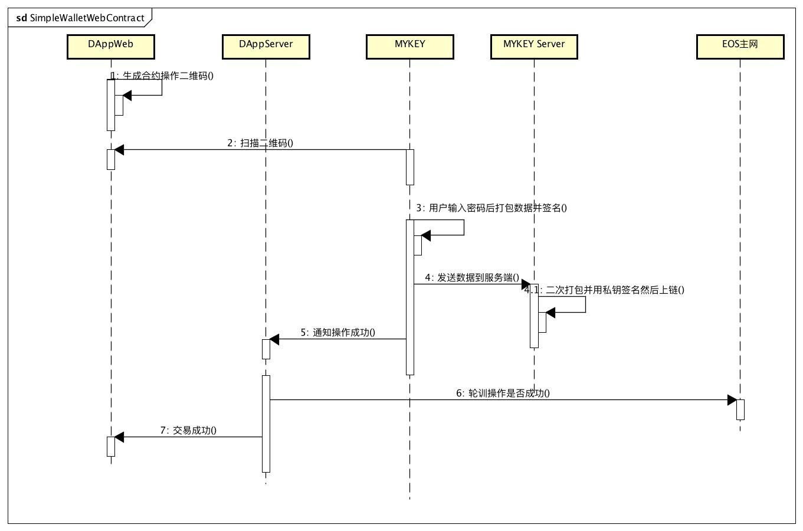
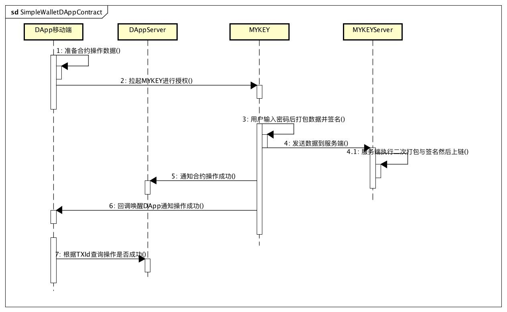
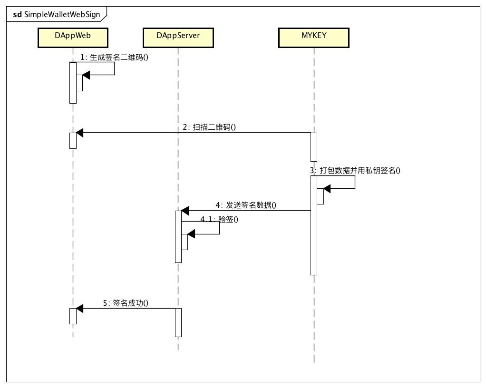
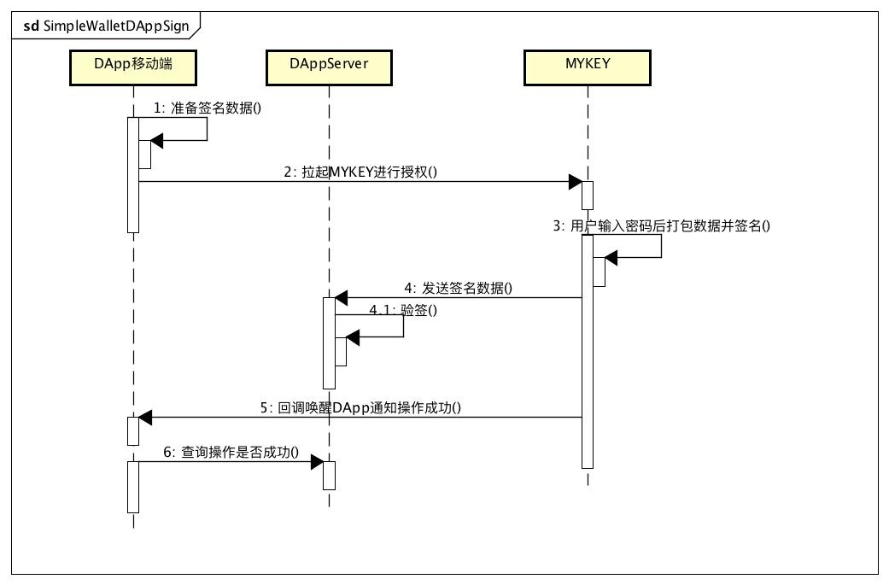

# MYKEY Development Toolkit


## 简介

MYKEY Development Toolkit(MDK)是方便开发者基于MYKEY账户体系开发应用的工具包。其包含MYKEY Client SDK，JSBridge Lib，Deeplink以及SimpleWallet协议扩展。该套开发者工具包可以帮助应用唤起MYKEY进行登录、转账、合约调用、签名等多种链上操作。该工具包暂只支持EOS链，并会随着MYKEY对多链的支持进行拓展。


## MYKEY Client SDK

MYKEY Client SDK 由 iOS SDK, Android SDK和MYKEY Core组成。

MYKEY Core通过GO语言实现，封装了MYKEY与MYKEY服务端和区块链交互的逻辑，目前以二进制包形式提供给Android以JNI方式，iOS以静态库方式调用，暂不对外开源。

Android SDK和iOS SDK可以帮助简化APP开发者使用MYKEY账号进行登录、转账、合约、签名操作。同时也封装了使用[eos-stake-token合约](https://github.com/mykeylab/eos-stake-token)发行的通证的额外合约操作，其中也包含了一些示例代码实现。

### Android SDK

[开源代码及文档](./MYKEY-ANDROID-SDK.md)

### iOS SDK

开源代码及文档

## JSBridge Lib

JSBridge 为MYKEY应用中心内嵌的浏览器环境中默认支持的JS注入库，其支持Scatter协议，开发者可以使用[Scatter文档](https://get-scatter.com/docs/api-reference)进行H5 DApp的开发。在支持以太坊后也会支持web3协议。

**特别注意:** [MYKEY的账号体系](https://github.com/mykeylab/Documentation/blob/master/English/MYKEY%20on%20EOSIO.md#mykey-account-structure)与其他的EOS账号有所差异，需要在服务端验签时使用Reserved公钥进行验签，详细请查阅[文档](https://github.com/mykeylab/Documentation/blob/master/English/MYKEY%20on%20EOSIO.md#if-dapp-dependents-on-getarbitrarysignature-or-other-server-side-authentication)

此外为了方便控制MYKEY应用中心浏览器的一些额外属性，如全屏，签名弹框方向，关闭应用等

### 开启全屏

进入全屏模式，应用可以通过isLandscape指定签名弹出框的方向

```
// isLandscape: 全屏模式中MYKEY签名弹出框的方向, ture为横屏，false为竖屏
window.MyKey.Browser.openFullScreen(isLandscape)
```

### 退出全屏
非全屏模式下，MYKEY签名弹出框永远为竖屏状态

```
window.MyKey.Browser.closeFullScreen()
```

### 退出
退出DApp,销毁当前DApp窗口

```
window.MyKey.Browser.closeWindow()
```

### 禁用返回

禁用系统原生返回按钮

```
window.MyKey.Browser.forbidPhysicalBack()
```

### 允许返回

允许系统原生返回按钮

```
window.MyKey.Browser.allowPhysicalBack()
```

## DeepLink协议

### 打开MYKEY

mykey://mykey.org/

### dapp跳转MYKEY并直接打开

mykey://mykey.org/dapp?url=%encodeURIComponent(Dapp_URL)%


## 兼容SimpleWallet协议

### 使用SimpleWallet跳转MYKEY代码示例

**特别注意:** Android端SimpleWallet跳转MYKEY时请使用如下代码（设置MYKEY的包名）

```
try {
    Intent intent = new Intent(Intent.ACTION_VIEW, Uri.parse(url));
    intent.setPackage("com.mykey.id");
    intent.setFlags(Intent.FLAG_ACTIVITY_NEW_TASK);
    context.startActivity(intent);
} catch (Exception e) {
    e.printStackTrace();
}
```

### 登录和支付

MYKEY遵循SimpleWallet协议实现，详细请见以下文档:

[https://github.com/southex/SimpleWallet/blob/master/README_en.md](https://github.com/southex/SimpleWallet/blob/master/README_en.md)

除了支持SimpleWallet规范的**登录**和**支付**，MYKEY还额外增强支持了**合约**和**签名**的调用。

**特别注意:** [MYKEY的账号体系](https://github.com/mykeylab/Documentation/blob/master/English/MYKEY%20on%20EOSIO.md#mykey-account-structure)与其他的EOS账号有所差异，需要在服务端验签时使用Reserved公钥进行验签，详细请查阅[文档](https://github.com/mykeylab/Documentation/blob/master/English/MYKEY%20on%20EOSIO.md#if-dapp-dependents-on-getarbitrarysignature-or-other-server-side-authentication)


### 合约

#### Web扫码调用合约时序图



#### 移动端App调用合约时序图


请传递给MYKEY如下的数据，数据格式为json：

```
// 合约调用数据格式
{
    protocol    string   // 协议名，本协议默认 SimpleWallet
    version     string   // 协议版本信息，如1.0
    action      string   // 操作类型，为 transaction
    dappName    string   // DApp应用名
    dappIcon    string   // DApp应用图标
    desc        string   // MYKEY显示给用户合约调用语义描述
    callback    string   // MYKEY回调DApp的深度链接，e.g. custom://custom.com/contract
    notifyUrl   string   // 合约调用成功通知DAppServer的回调URL接口
    ContractRequest [  //合约操作数组，包含转账与非转账合约操作
      { //非转账
    	  account   string // 合约名
    	  name      string // 合约方法
    	  info      string // MYKEY显示给用户的语义化描述
    	  data      object // 根据合约abi定义所传的参数对象 e.g. {key1: value1, key2: value2 }
      },
      { //转账
    	  account   string // 合约名
    	  name      string // 合约方法
    	  info      string // MYKEY显示给用户的语义化描述
    	  TransferDataRequest {
    	    from     string // 转账From
    	    to       string // 转账To
    	    quantity string // 转账金额和单位，e.g. "1.0000 EOS"
    	    memo     string // 链上备注
    	  }
      }
    ]
    expired	    number   // 仅Web二维码模式可用，过期时间，unix时间戳
}
```


### 签名

#### Web扫码调用签名时序图


#### 移动端App调用签名时序图


请传递给MYKEY如下的数据，数据格式为json：

```
// 签名调用数据格式
{
    protocol    string   // 协议名，本协议默认 SimpleWallet
    version     string   // 协议版本信息，如1.0
    action      string   // 操作类型，为 sign
    dappName    string   // DApp应用名
    dappIcon    string   // DApp应用图标
    desc        string   // MYKEY显示给用户签名调用语义描述
    message     string   // 需要签名的内容
    callback    string   // MYKEY回调DApp的深度链接，e.g. custom://custom.com/contract
    notifyUrl   string   // 签名成功通知DAppServer的回调URL接口
    expired     number   // 仅Web二维码模式可用，过期时间，unix时间戳
}
```


## ISSUE报告

请在github中的issue板块提交ticket

## FAQ
