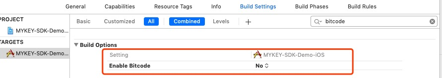
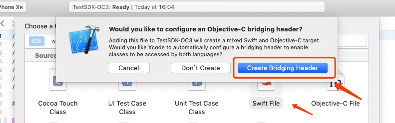

# 环境准备

对于iOS用户，按照以下步骤集成:

### 1. 添加MYKEYWalletLib-iOS.zip

在项目中下载MYKEYWalletLib-iOS.zip，解压后，拖进工程目录；

​[https://github.com/mykeylab/MYKEY-Client-SDK/tree/master/iOS](https://github.com/mykeylab/MYKEY-Client-SDK/tree/master/iOS)​

### 2. 添加URL Scheme 

在Xcode设置URL scheme: Project-&gt;TARGETS-&gt;info-&gt;URL Types-&gt;添加 URL scheme；

例如使用demoscheme，详见下图

这个配置会自动生成MYEKY回掉的深度链接，将会被用于MYKEY SDK的初始化方法中.[详见 initWalletSimple](https://docs.mykey.org/chinese/mykey_ios_sdk#initwalletsimple).

### 3. 添加 LSApplicationQueriesSchemes

在info.plist中LSApplicationQueriesSchemes下添加一项，值为mykey；

### 4. 设置 Enable Bitcode

Build Settings 下 Enable Bitcode置为false

### 5. 备注

该库使用swift编写，Objective-C工程需要配置Bridging-Header.h文件，如果工程中没有，可以创建Empty.swift\(一个空的swift文件\)，工程会自动生成Bridging-Header.h。

